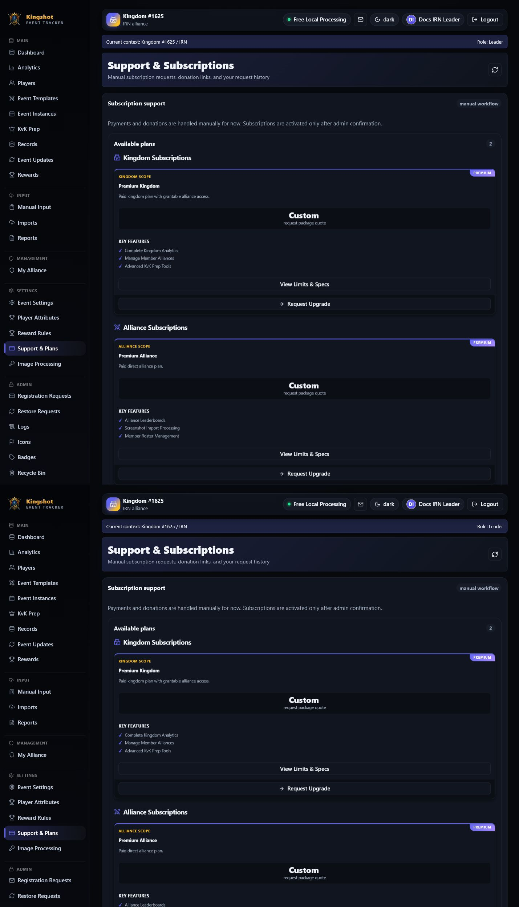

# Payment Instructions & Completing a Request

Once you've [requested a subscription](request-subscription.md), payment (if any) is arranged **manually** through the request's message thread. This page explains how that works and what to expect.

## There is no online checkout

> **The app does not process payments.** There's no card form, no checkout, and no automatic billing inside the tracker. Nobody is asked to enter payment details into the app. Everything happens through the **message thread** on your request and whatever **payment or donation links** the Supreme Admin has set up.

This keeps money handling outside the app entirely — you pay through the method your admin tells you to use, not through a page here.

## How it flows

1. You submit a request (see [Request a Subscription](request-subscription.md)). It starts as **Pending**.
2. The Supreme Admin reviews it and, if payment is needed, **sends payment instructions**. Your request moves to **Awaiting payment**.
3. You read the instructions in the thread, pay by the method described, and **reply** to confirm (for example, "Paid — sent via PayPal").
4. The admin verifies and marks the request **Completed**. Your [plan](../getting-started/glossary.md#plan) activates and your [effective plan](effective-plan.md) updates.

## Reading the payment instructions

The admin's instructions arrive as a message in your request thread. They'll tell you **how much**, **how to pay**, and **how to confirm**. Alongside them you may see **support links** — things like a PayPal or Revolut link, a Discord invite, or crypto addresses — that the Supreme Admin configured for the platform. Use whichever method the instructions point you to.

> Where do those links come from? A Supreme Admin sets them up. That setup is covered in [Configure Support Links](../admin/support-links.md) *(admin section)*. As a requester, you just use the links you're given.

## Confirming payment

After you've paid, **reply in the thread** to let the admin know. Include anything that helps them match your payment (the method you used, a reference, the date). The admin then completes the request on their side — you don't activate the plan yourself.

## After completion

When the request is marked **Completed**:

- The plan is assigned and becomes active.
- Your Subscription & Usage panel shows the new plan and higher limits.
- Premium features unlock (see [Premium Features](premium-features.md)).

If something looks wrong after completion — the wrong plan, missing features — reply in the same thread; the admin can adjust.

## If you change your mind

While a request is still open (pending or awaiting payment), you can **cancel** it. If you've already paid, don't cancel — talk to the admin in the thread instead.

## Where to go next

- [Request a Subscription](request-subscription.md) — the step before this one.
- [Which Plan Applies to You](effective-plan.md) — confirming your new plan took effect.
- [Quota Warnings](quota-warnings.md) — making the most of your new limits.
