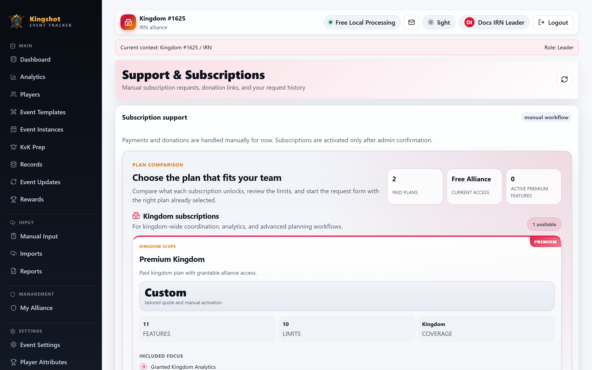

# Plans & Tiers

A **[plan](../getting-started/glossary.md#plan)** sets your limits and unlocks features. There are plans for **kingdoms** and plans for **alliances**, and each comes in a free tier and a premium tier.

## The free tier — what you start with

Every kingdom and every alliance always has a **[free tier](../getting-started/glossary.md#free-tier-fallback-plan)**, automatically, from the moment it exists. You don't request it, choose it, or see it listed as an option — it's simply what applies when nothing premium is active. It's there quietly in the background so that limits always exist.

The free tier is generous enough for normal tracking. You only need premium if you bump into limits or want the extra features.

> You won't find "Free Kingdom" or "Free Alliance" in the plan list you can request. Those are internal fallback tiers, not things you sign up for. If you're on free, that's the default — there's nothing to select.

## Premium plans — what you can request

The plans you can actually **request** are the premium ones. There are two, matching the two levels of the app:

### Premium Alliance
For a single alliance. Raises that alliance's limits and unlocks the alliance-focused premium features — including analytics that follow a player across events and recommendation tools. Best when one alliance wants more room and better insights for itself.

### Premium Kingdom
For a whole kingdom. Raises the kingdom's limits, unlocks kingdom-level premium features, and — importantly — lets the King **[grant](../getting-started/glossary.md#grant)** premium to alliances inside the kingdom. Best when a King wants to lift the whole kingdom and share premium with several alliances.

> A Supreme Admin can create additional custom plans beyond these two. If your platform offers others, they'll appear in the request list with their own limits and features. The two above are the standard premium plans that ship with the app.

## What a plan actually contains

Whatever the tier, a plan is made of:

- **Limits** ([quotas](../getting-started/glossary.md#quota--limit)) for each kind of resource — players, alliances, events, event instances, results, screenshots, storage space, imports, users, and (for kingdom plans) how many alliances the King can grant to.
- **Premium features** — the extras it switches on (see [Premium Features](premium-features.md)).

Premium plans have higher limits and more features than the free tier. The exact numbers can differ between platforms, so the reliable way to see *your* limits is your **Subscription & Usage panel** — it always shows your real ceilings, not a generic list.

## About prices

Plans may show pricing information, but **the app does not process payments**. There is no checkout, card entry, or automatic billing. Any payment is arranged manually with a Supreme Admin — see [Payment Instructions](payment-instructions.md).

## Where to go next

- [Which Plan Applies to You](effective-plan.md) — how the app decides your **effective plan** when more than one could apply.
- [Premium Features](premium-features.md) — the full list of what premium unlocks.
- [Request a Subscription](request-subscription.md) — how to ask for a premium plan.
