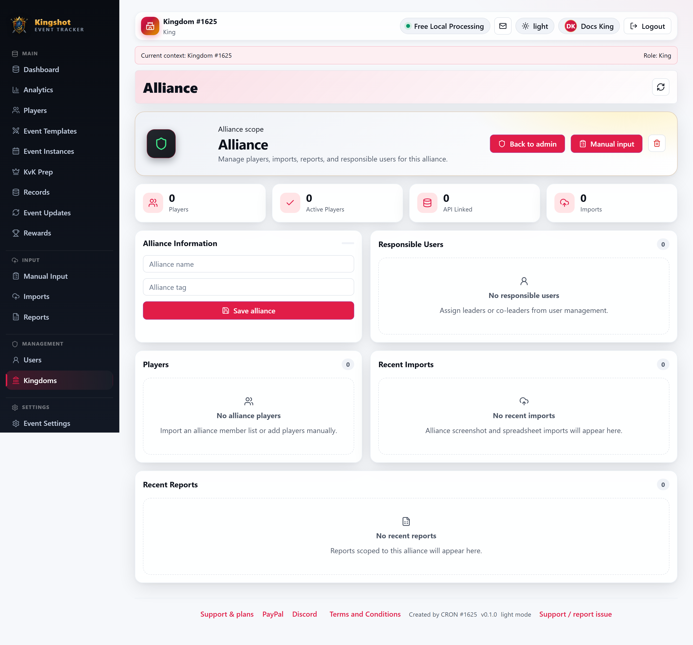

# Suspension & Limited Mode

**[Suspension](../getting-started/glossary.md#suspension)** is a paused, mostly read-only state for a kingdom or alliance. It happens either because a hard limit was reached, or because a Supreme Admin paused the scope on purpose. This page explains why it happens, what still works, and how it ends.

## What suspension feels like

A suspended kingdom or alliance shows a **banner** explaining the situation, and new changes are blocked. You can still see your data - it's a pause, not a deletion.



## Why a scope gets suspended (the reasons)

A suspension always has a **reason**. The reason matters, because it decides whether the pause spreads from a kingdom down to its alliances:

| Reason | Set by | Meaning |
|---|---|---|
| **Usage limit** | Automatic | A hard resource limit was reached. This is the "you filled something up" case. |
| **Manual** | Supreme Admin | Paused by hand for a general reason. |
| **Admin** | Supreme Admin | An administrative pause. |
| **Abuse** | Supreme Admin | Paused due to misuse. |
| **Global** | Supreme Admin | A platform-wide administrative pause. |

> **Automatic usage-limit suspension:** when a kingdom or alliance fills a hard-limited resource to 100%, the app can place it into usage-limit mode on its own. The good news is it also **lifts on its own** once you clean up enough - see "How it ends," below.

## Does a kingdom's suspension affect its alliances? (cascade)

When a **kingdom** is suspended, whether that pause reaches the alliances inside it depends on the reason - and on whether an alliance stands on its own plan.

```
        KINGDOM is suspended
                │
        what's the reason?
        │                          │
  "usage limit"            "manual / admin / abuse / global"
        │                          │
        ▼                          ▼
  Does the alliance          Does the alliance have a
  have its OWN paid          Supreme-Admin override for
  (direct) plan?             parent suspension?
     │        │                 │            │
    yes       no               yes           no
     │        │                 │            │
     ▼        ▼                 ▼            ▼
  SURVIVES  paused          SURVIVES       paused
 (keeps     with the       (exempted)     with the
  working)  kingdom                        kingdom
```

In words:

- **An alliance's own suspension** always pauses that alliance, no matter what.
- For a **usage-limit** kingdom suspension: an alliance that has its **own direct paid plan survives** - it keeps working. An alliance riding on the free tier (or only on a grant) is paused along with the kingdom.
- For the **harder reasons** (manual, admin, abuse, global): the pause cascades to alliances **unless** a Supreme Admin has given that alliance a specific override.

This "own plan survives a usage-limit kingdom pause" rule is the main reason an alliance might choose a [direct subscription](direct-alliance-subscription.md).

## What still works in limited mode

A suspended (limited) scope keeps **read access** and allows **cleanup**, while blocking anything that would add to your data. Concretely:

**Blocked while suspended** - every action that creates or adds a tracked resource:

- Adding players
- Creating events and event instances (sessions)
- Entering results - both manual entry and applying screenshot/spreadsheet imports
- Uploading screenshots (and the storage they use)
- Creating alliances
- Creating users

**Still allowed** - viewing and tidying up:

- Viewing all your dashboards, analytics, players, events, and history
- Running a [cleanup](cleanup.md) and deleting things you no longer need (this is how you recover from a usage‑limit pause)

If you try a blocked action you'll get a message that the scope is suspended and the action is disabled until the pause is lifted. The on‑screen banner is always the authoritative source for your specific situation.

## A note on "grace period"

Behind the scenes a subscription can carry a **grace period** status. This is an internal state the app treats like an active plan - it is **not shown to users** in the app and needs no action from you. You'll only ever see a plan as active or suspended in your usage panel.

## How suspension ends

- **Usage-limit (automatic):** clean up enough that usage drops back to a safe level (around 95% or below) and the app **automatically restores** the scope. See [Run a Cleanup](cleanup.md). This is the fastest path - you're in control.
- **Manual / admin / abuse / global:** only a **Supreme Admin** can lift these, by unsuspending the scope. If you're paused for one of these reasons, contact your Supreme Admin.

## Where to go next

- [Run a Cleanup](cleanup.md) - the way out of a usage-limit suspension.
- [Quota Warnings](quota-warnings.md) - catching problems before they become a suspension.
- [Direct Alliance Subscriptions](direct-alliance-subscription.md) - how an own plan survives a kingdom usage-limit pause.
