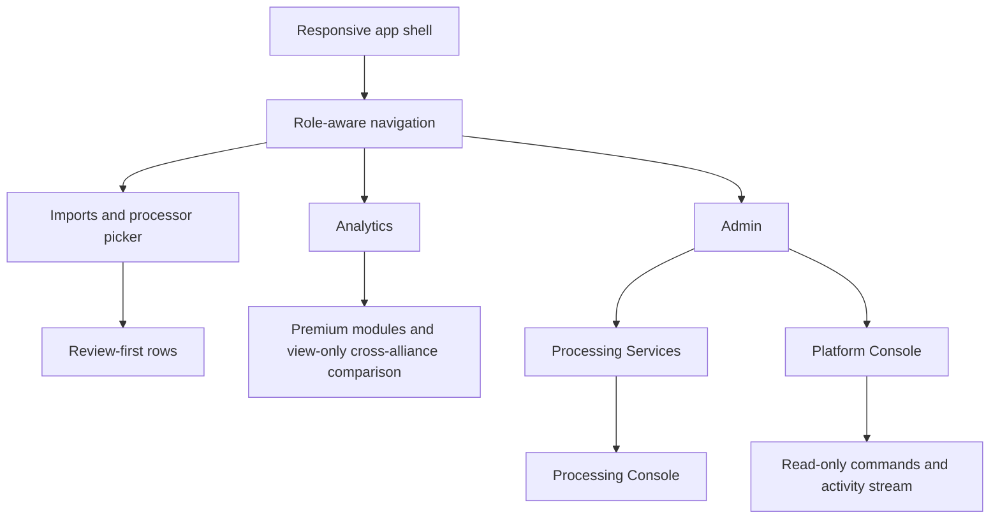

# Patch Notes — 13 July 2026

> **Mobile, processors, consoles, analytics, administration, and security.** This page records the user-visible and operational changes completed on 13 July 2026. It intentionally omits credentials, tokens, private screenshots, and internal runtime values.

## User interface and responsive layout

**Who is affected:** everyone.

- Phones and tablets now use a role-aware navigation drawer; desktop retains the persistent navigation and header while scrolling long pages.
- Tables, forms, dialogs, imports, analytics, administration, processor selection, and consoles adapt for small and medium screens. Dense tables keep their columns through horizontal scrolling or compact cards rather than silently dropping data.
- Dialogs have clearer focus behavior and labelled icon controls. Keyboard Escape closes supported dialogs; focus returns to the invoking control.
- The Users page is a full-width management surface with an explicit filter/sort toolbar and pagination rather than a compressed side panel.

Read [Mobile & Tablet](/roadmap/mobile-responsive-web) and [Create & Manage Users](/how-to/create-user).

## Image processing

**Who is affected:** import and KvK users; Supreme Admins operate services.

- The picker has exactly three categories: **Free**, **With Keys**, and **Premium**. Selection is compact and reused by settings, Imports, KvK, and the header chip.
- **Terra** remains the local free processor but is deliberately conservative: suspicious names, impossible values, malformed OCR, duplicates, low confidence, and uncertain power/score reads go to review with a reason instead of looking ready.
- **Henod** is a platform-managed Free processor. When upstream health or shared credits fail, it is unavailable for new work and requires a Supreme Admin re-check after the cause is resolved. Users never enter a Henod key.
- **Gemini** and **OpenAI** remain bring-your-own-key processors. A browser/user key is needed; it is not replaced by a server key in the normal user flow.
- **Premium Processor** requires both the selected scope's `premium_processing` entitlement and a healthy, admin-enabled service. Entitlement, disabled, coming-soon, and technical-unavailable states are distinct. Normal users receive a safe message; diagnostics are Supreme-Admin-only.
- Multi-role accounts resolve premium features using the selected kingdom/alliance scope, so an administrator who is also a leader receives that alliance's active premium features in that scope.

Read [Choose a Provider](/imports/choose-provider), [Henod](/imports/openrouter-free-ai), [Premium Processing](/imports/premium-processing), and [Processing Services](/admin/processing-services).

## Consoles and activity monitoring

**Who is affected:** Processing Services/Console and Platform Console are Supreme-Admin-only.

- **Processing Services** is configuration and health: provider state, safe diagnostics, enablement, health checks, re-check/reset actions, and metrics.
- **Processing Console** is the live OCR/import job stream. It is not a configuration screen.
- **Platform Console** is the separate global operations terminal. It has a terminal visual system, a bundled Glass TTY VT220 font, live platform events, selected-event detail, and activity/session information.
- Platform Console commands are read-only: `help`, `status`, `whoami`, `sessions`, `logins`, `activity`, `users online`, `processors`, `imports`, `subscriptions`, `analytics`, `events`, and `clear`.
- Live polling updates the event stream without resetting local command output, command history, selected detail, input, filters, or scroll intent.
- Admin activity includes successful/failed logins, session presence, last seen, current/last page, scoped activity, device/user-agent data when available, and IP/country only when the deployment can safely provide them. Private/local addresses are reported as local/unknown; no external geo lookup is required.

Read [Processing Console](/imports/processing-console) and [Platform Console](/admin/platform-console).

## Analytics and premium visibility

**Who is affected:** alliance leaders, kings, and premium scopes.

- Analytics is a single experience with free modules and premium modules unlocked in place—not separate marketing pages. Large areas such as custom analytics, player comparison, session/event comparison, recommendations, mega-alliance views, tables, and charts can collapse while retaining their summary and local expanded state.
- Free insight includes activity/participation trends, event participation summaries, player-status distribution, recent import quality, and reward-eligibility summaries when source data exists.
- Premium insight includes player consistency, alliance health, cross-event player comparison, event-performance trends, missing-player risk, reward recommendations, import-quality trends, stage/event comparison, and explainable leader suggestions. Each module explains its purpose, source data, and insufficient-data state.
- Kingdom Premium can grant accepted alliances access to **view-only** cross-alliance analytics only when the King enables the cross-alliance analytics setting and the plan includes the feature. Data stays per alliance unless a comparison is expressly selected. Leaders cannot import, edit, delete, reward, or manage another alliance's data.

Read [Analytics Overview](/analytics/overview), [Custom Analytics](/analytics/custom-analytics), [Player Cross-Event Analytics](/analytics/player-cross-event), [Recommendations](/analytics/recommendations), and [Kingdom Grants](/subscriptions/kingdom-grants).

## Administration and policies

**Who is affected:** administrators and users managing scopes.

- Users support search, backend pagination, 20/50/100 page sizes, role/kingdom/alliance/status/presence/password-state filters, sort order, last-seen/login context, and protected actions.
- Permissions are an admin-only grouped catalog with plain-language descriptions, category/search controls, risk guidance, and role comparison. Backend enforcement remains authoritative.
- Badges are honestly documented as a preview/limited feature. Icons are configurable today; dedicated badge assignment management is not represented as complete.
- Restore Requests are a real scoped workflow: users request recovery from the recycle bin when they lack restore permission; permitted reviewers approve/reject; approved recovery is audited. The queue supports status and scope context.
- Terms & Conditions now describe roles, screenshots, OCR, optional user keys, subscriptions, analytics, admin monitoring, privacy requests, cookies/session tracking, acceptable use, no game-automation purpose, and the independent-platform disclaimer. It must be reviewed by a qualified legal professional before public production use.

Read [Users](/how-to/create-user), [Permissions](/admin/permissions), [Badges](/admin/badges), [Restore Requests](/how-to/restore-requests), and [Terms & Privacy](/admin/terms-and-privacy).

## Security and privacy

- Private screenshots/import assets are served through authenticated, scope-checked API access—not public static `/uploads` URLs. A correct alliance/kingdom scope or Supreme Admin role is required.
- Spreadsheet imports accept `.xlsx` and `.csv` with strict limits: 2 MB upload size, 1,000 data rows, 50 columns, and 500 characters per cell. Legacy `.xls`, formulas, macros, external links, oversized files, invalid files, and unsafe scope requests are rejected.
- Upload previews remain inside the authenticated application and use private/no-store and same-origin resource protections.
- The dependency safety pass removed the legacy spreadsheet parser and current verification reports zero known npm audit vulnerabilities.

Read [Upload Screenshots](/imports/upload-screenshots), [Spreadsheet Import](/how-to/spreadsheet-import), [Privacy, Security & Fair Use](/roadmap/privacy-security-and-fair-use), and the project `SECURITY.md` for technical details.

## Visual architecture

## Known limitations

- OCR is assistive extraction, not a guarantee of correctness; review remains mandatory for uncertain rows.
- Henod and Premium availability depends on the active backend runtime and upstream services. A safe maintenance restart may be required after changing backend environment configuration.
- IP country is only displayed where the deployment provides it without an unconfigured external lookup.
- The terms are practical platform language, not legal advice.
- Dedicated badge assignment workflows remain planned; the current Badges page is intentionally limited.
