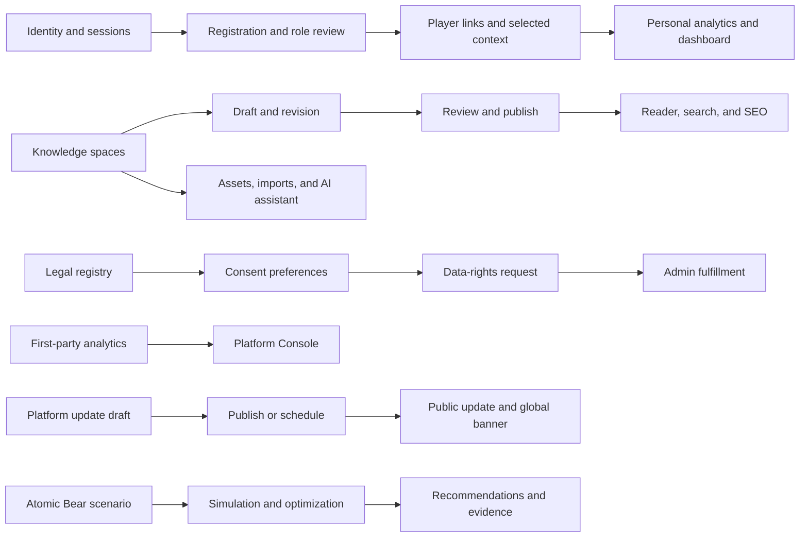
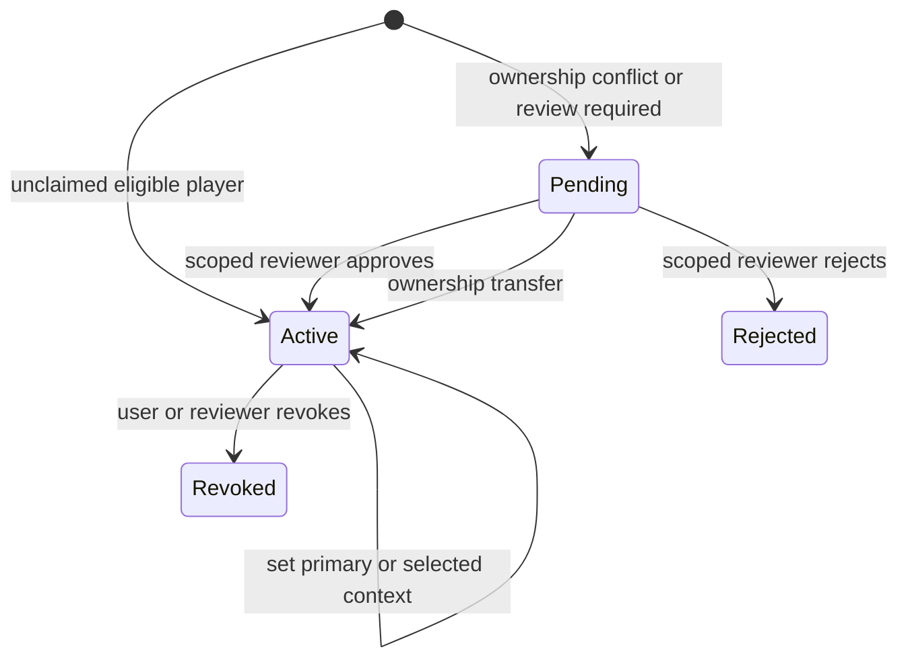
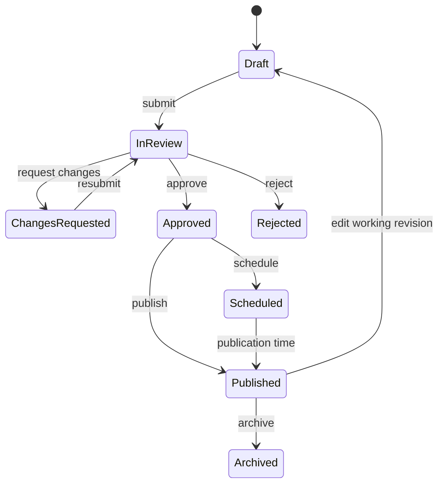
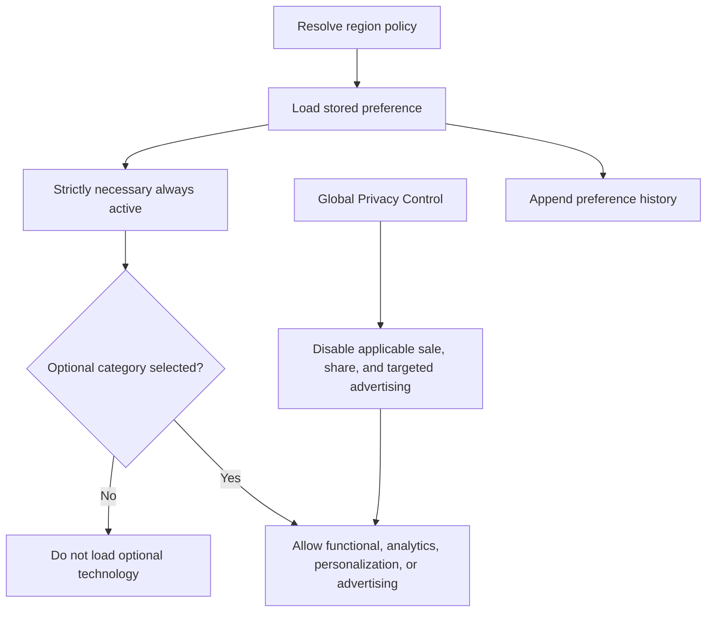
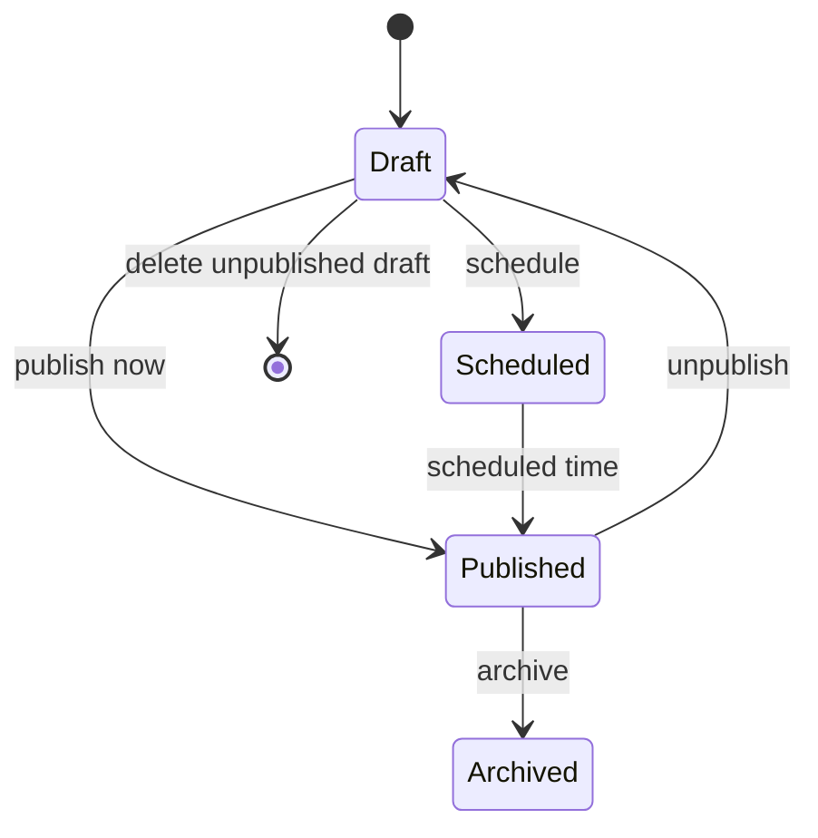

# 25-29 July 2026 System Update

## Scope of this update

This page documents the user-facing changes released from Saturday, 25 July through Wednesday, 29 July 2026. Internal repository references, security implementation details, infrastructure identifiers, and deployment information are intentionally excluded from this public page.

## Short release overview

This release adds three complete platform capabilities:

1. **Kingshot Knowledge Hub** with public, Kingdom, and Alliance spaces, structured articles, authoring, review, publication, revisions, search, assets, imports, and optional Gemini writing assistance.
2. **Unified legal and privacy controls** with versioned policies, consent categories, privacy preferences, regional rights, data-rights requests, and an administrative fulfillment queue.
3. **Platform updates and first-party analytics** with public release pages, global announcements, publication management, privacy-safe analytics, live presence, period comparisons, and reliability metrics.

It also replaces several older account and simulator assumptions:

- Sessions can be listed and revoked.
- Password resets use one-time action links instead of emailed temporary passwords.
- Registration can activate a safe viewer account while a higher role remains under review.
- One account can link to multiple Kingshot player profiles and select its active player context.
- The Bear Trap simulator now models atomic inputs, hero progression, leader lineups, joiner captains, formation optimization, squad bonuses, and detailed rally evidence.
- Event Settings now uses a searchable template manager with persistent selection and clearer configuration sections.

## Change map

## 1. Account identity, sessions, and password actions

### Persistent sessions

Account sessions are now visible and manageable from the user profile.

Users can:

- list their active sessions;
- revoke one session;
- log out other sessions;
- log out all sessions.

Role, assignment, and permission changes take effect without unnecessary device logout. Explicit account-security actions can still end active sessions.

### One-time password actions

Password reset and initial password setup now use one-time links.

The forgot-password flow now supports two operating modes:

- **Administrator approval required:** a request enters the review queue, an authorized administrator resolves the account, and approval sends a one-time reset link.
- **Self-service:** a matching eligible account receives a one-time reset link immediately.

Administrators can filter and review password requests, while public responses avoid exposing account availability.

### Registration and role requests

Registration can now create an active account with a safe temporary role while the requested role is reviewed separately.

The request keeps its requested role, temporary access, relevant Kingdom or Alliance, review status, and reviewer note. A configurable pending message explains the wait to the new user.

### Deleted identity protection

Deleted usernames and email addresses are protected from unsafe reuse. This helps preserve account history and prevents accidental reassignment.

### Moderator support

Moderator access is now consistently recognized across:

- registration settings;
- role requests;
- permissions;
- administration;
- subscription feature visibility;
- password-reset review.

Moderator actions remain limited to their assigned scope.

## 2. Player identity links and selected context

Registration now matches a Kingshot profile by profile ID rather than only by a display name.

Player links now support:

- multiple player links for one account;
- pending, active, rejected, and revoked history;
- one primary link;
- a selected player context;
- reviewer and verification details.

Conflict behavior is deliberate:

- an unclaimed player can become active immediately;
- an already claimed player creates a pending conflict;
- reviewers cannot approve their own link;
- only scoped reviewers can approve, reject, revoke, or transfer a link;
- deleted or otherwise ineligible players cannot be linked;
- repeating the same request does not create duplicate work.

The profile page supports listing, requesting, selecting, and revoking links. Administrators have a dedicated Player Link Reviews page.

## 3. Personal analytics and dashboard access

The personal analytics response and page were expanded from a score summary into a player workspace.

It now includes:

- player and linked-profile identity;
- recorded coverage;
- participation and score metrics;
- deterministic actionable insights;
- event score, participation, attendance, and consistency charts;
- reward progress;
- goals and milestones;
- upcoming events;
- Castle Position readiness;
- notifications;
- Alliance resources and announcements.

### Safe comparison policy

Alliance comparisons are not automatically exposed. The platform decides whether aggregate or anonymized comparison data is allowed for the current user.

The response includes:

- whether Alliance aggregate context is visible;
- whether anonymized comparisons are allowed;
- the minimum cohort size;
- the reason when comparison data is hidden.

Unknown records stay unknown. They are not converted to zero scores.

### Dashboard permission fix

Alliance-scoped players can now load the dashboard data they are entitled to. The fix aligns the frontend dashboard contract with the server response and removes an incorrect denial for permitted Alliance users.

## 4. Kingshot Knowledge Hub

The Knowledge Hub is a standalone product shell at `/knowledge`. It shares platform accounts, sessions, assignments, subscription entitlements, notifications, advertising controls, and game catalogs, but owns its content model.

### Space model

Three space types are available:

| Space | Purpose | Scope rule |
|---|---|---|
| Global | Public guides and game database content | Explicit global authority |
| Kingdom | Kingdom-specific guides and announcements | Active Kingdom assignment |
| Alliance | Alliance guides and instructions | Direct active Alliance assignment |

A Kingdom-level assignment does not grant authoring access inside every Alliance space.

### Content model

Knowledge content includes:

- spaces, sections, and categories;
- articles and immutable revisions;
- reviews;
- tags;
- assets;
- structured game-entity relations;
- imports;
- slug history;
- notifications.

Article types include hero guides, event guides, game mechanics, strategy guides, news, Kingdom announcements, Alliance guides, comparisons, and beginner tutorials.

Content can be public, available to signed-in users, included with selected features, or restricted to members of its Kingdom or Alliance. Readers either receive the full article, an appropriate preview, or an access message.

### Structured article blocks

Articles use sanitized typed blocks, not raw HTML:

| Group | Block types |
|---|---|
| Text | heading, paragraph, quote |
| Guidance | tip, warning, steps, checklist |
| Data | table |
| Media | image, gallery |
| References | hero, event, mechanic, related article |
| Access | premium boundary |

Unsupported or unsafe content is rejected before publication.

### Editorial lifecycle

Publishing retains the published revision pointer while the editor can continue working on a newer revision. Scoped publishers can request Global publication, but cannot publish globally without the separate global permission.

### Reader and discovery

The standalone shell provides:

- Knowledge home;
- all guides;
- Heroes, Events, and Mechanics databases;
- article and space readers;
- search;
- scoped Kingdom and Alliance spaces;
- related guides;
- JSON-LD article metadata;
- Knowledge sitemap and SEO routes.

### Studio, review, import, assets, and AI

The Studio includes:

- draft creation by space;
- article metadata and block editing;
- revision history;
- category selection;
- submit, review, and publish actions;
- Markdown or structured-content import preview;
- imported draft creation.

Imports never publish directly. They create a draft after parsing, validation, sanitization, and warning generation.

The asset library:

- uses safe public image references;
- records asset type, dimensions, alternative text, entity relation, and usage;
- seeds the existing hero portrait catalog;
- supports search and deterministic recommendations based on article context.

The optional writing assistant:

- previews the exact context before any provider call;
- requires explicit confirmation for private scoped content, unpublished premium content, or review notes;
- returns a suggestion for preview;
- does not write directly to the article.

## 5. Legal Center, consent, and data rights

The platform now has a versioned legal bundle.

Documents include:

- Terms of Service;
- Privacy Notice;
- Cookie and Storage Technologies Policy;
- Acceptable Use Policy;
- Community Guidelines;
- Data Rights.

Each document can include:

- version and publication status;
- effective, scheduled, published, and superseded dates;
- change summary;
- material-change flag;
- reacceptance requirement;
- affected products and regions;
- author, reviewer, and publisher.

Product supplements distinguish the Ralyvora platform, Portal, and Kingshot Events.

### Consent model

Preferences record:

- region and source;
- functional, analytics, personalization, and advertising choices;
- Global Privacy Control;
- schema version;
- change history.

Registration records Terms acceptance and Privacy Notice acknowledgement separately. A registration flow token returns the user to the correct form after completing the legal step.

### Technology, provider, and retention information

The Legal Center explains:

- cookies, local storage, session storage, beacons, pixels, and other technologies;
- configured processors and purposes;
- data categories and affected products;
- processing location and transfer information where confirmed;
- retention behavior;
- confirmation and legal-review status.

Unknown operator, legal, transfer, and retention facts remain marked for owner or legal confirmation. The application does not invent them.

### Privacy requests

Users can submit and track:

- access or export;
- deletion;
- correction;
- restriction;
- objection;
- portability;
- sale/share or targeted-advertising opt-out;
- sensitive-data limitation;
- consent withdrawal;
- appeal;
- other privacy matters.

Each request has status, region, product context, deadline, assignment, response, exceptions, and an append-only event history.

The Supreme Admin console adds pagination, status filtering, search, request inspection, response text, and status updates.

## 6. Public platform updates and announcements

Kingshot Events now has:

- an Updates archive;
- category filtering;
- cursor pagination;
- individual update pages;
- previous and next navigation;
- latest update on the public home page;
- a global update banner.

The update publication model stores:

- draft, scheduled, published, or archived status;
- public or authenticated visibility;
- category;
- version label;
- safe plain-text content;
- tags and platform areas;
- ordered change items;
- published-edit revision snapshots;
- announcement settings;
- per-user dismissals by announcement version.

Announcements can target everyone, anonymous visitors, authenticated users, or selected roles. They support start and end times, priority, dismissal, and reannouncement through a version increment.

Platform Console adds Updates management and announcement performance metrics.

## 7. First-party platform analytics

Platform Analytics provides privacy-conscious traffic, engagement, feature usage, live activity, and reliability reporting. It avoids presenting signed-in identities in the live activity feed and filters automated traffic from normal usage reporting.

Platform Console includes:

- overview;
- real-time activity;
- traffic;
- engagement;
- features;
- reliability.

Periods include Today, This week, This month, and Custom with a reporting timezone. KPIs compare the selected period with the immediately preceding period. A zero previous value produces no misleading percentage.

Metrics cover visitors, authenticated users, registrations, returning visitors, sessions, page views, views per session, engaged duration, engagement, single-page sessions, successful and failed logins, and conversion.

Live presence uses a five-minute active window. Reliability reports request volume, 4xx and 5xx rates, and p50 and p95 latency.

## 8. Bear Trap simulator and combat-model changes

### Atomic scenario model

The simulator now represents each source layer explicitly:

- calculation scope and rally role;
- troop stacks by owner, type, tier, True Gold, and quantity;
- effective Infantry, Cavalry, and Archer statistics;
- leader heroes, widgets, and expedition skills;
- joiner captains and join order;
- rally capacities and accepted troops;
- Bear and temporary effects;
- source metadata and assumptions.

Legacy presets migrate into the atomic schema.

### Formation and lineup optimization

The optimizer can evaluate:

- current formation;
- best Infantry, Cavalry, and Archer allocation;
- one-player, one-joiner, all-joiners, and total-rally composition scopes;
- leader hero swaps with formation re-optimization;
- best valid leader trio within the available generation;
- rally capacity and troop acceptance.

A hero swap is not judged only against the old troop mix. The formation is recalculated for the candidate lineup.

### Joiner captain logic

Joiner captain selection now:

- reads the first Expedition skill;
- separates Bear-relevant and defensive skills;
- ranks the four active skill slots;
- respects join order as the tie-break;
- models stacking families;
- marks chance-based effects as variable;
- includes Master Cassia as a supported source.

### Hero progression

Hero progression records:

- zero through five completed stars;
- zero through five slices toward the next star;
- verified shard cost per slice;
- remaining cost to the next star and five stars;
- independently configured Expedition skill levels.

At five stars, slices normalize to zero. Star slices are not treated as invented intermediate skill levels.

### Stats, calibration, and evidence

The profile and simulator now support squad-wide attack, defense, health, and lethality bonuses in addition to troop-type bonuses.

Squad bonuses are interpreted consistently across saved profiles, Bonus Overview, Bear calculations, and Hero Gear projections.

Calibration and shared experience capture support:

- bonus overview;
- rally-leader report;
- beast report;
- manual input;
- exact, estimated, or unknown joiner confidence;
- total and per-type joiner troops;
- full-rally status;
- detailed skill and widget snapshots;
- duplicate and outlier quarantine checks.

The update also removes an obsolete leader overflow warning because formation capacity already handles that case.

### Editor and accessibility

The guided editor now has:

- setup status;
- clearer role and workflow selection;
- troop, stat, hero, joiner, effect, review, simulation, and result sections;
- inline hero portraits;
- skill audit;
- ranked recommendations;
- readable value colors;
- responsive layouts;
- improved focus, labels, and density.

## 9. Event Settings redesign

Event Settings now begins with a template-management workspace.

It adds:

- summary counts for total templates, multi-stage or multi-day templates, and custom templates;
- search by event name or category;
- event type and duration filters;
- selected-row state;
- persistent event selection when moving between tabs;
- Template Library, Configure Event, Score Rules, and Recommended Presets views;
- event preview and save actions;
- structured configuration cards;
- clearer validation messages;
- isolated stylesheet for the page.

Configuration is grouped into:

- basic information and identity;
- scoring and entry rules;
- stage rules;
- membership and roster snapshot policy;
- visibility, analytics, and rewards.

Preset selection copies supported defaults into the editor for review before save. Score-threshold rules remain attached to the selected event.

## 10. Advertising, SEO, and public pages

Advertising readiness now integrates with the consent system and policy registry.

Changes include:

- Google advertising readiness;
- consent-aware advertising adapter;
- privacy, cookie, advertising disclosure, privacy choices, and data-rights routes;
- public Legal Center and policy pages;
- SEO metadata for Knowledge, legal, data-rights, and updates pages;
- improved search-engine discovery;
- public-page layout and accessibility updates.

Advertising remains disabled until configuration, approval, policy, and consent conditions are satisfied.

## 11. Platform Console and quality improvements

Platform Console now includes:

- Platform Analytics;
- Platform Updates management;
- Legal and Privacy readiness;
- latest published update in the console runtime response.

Additional quality improvements include:

- clearer numeric controls without browser spinner overlays;
- more consistent account permission updates;
- safer update, legal, and privacy workflows;
- broader accessibility and responsive-layout coverage;
- improved public-page discovery and navigation;
- stronger consistency between saved simulator profiles and calculation tools.

## 12. Release coverage

The public release notes cover every user-visible area changed during the period. Internal source references, database structure, infrastructure configuration, security implementation, diagnostics, and private verification details are intentionally omitted.

## Related guides

- [Knowledge Hub overview](/knowledge/overview)
- [Knowledge authoring and review](/knowledge/authoring-and-review)
- [Knowledge assets, imports, and AI](/knowledge/assets-imports-and-ai)
- [Account sessions, role requests, and player links](/getting-started/account-security-and-player-links)
- [Legal, consent, and data rights](/admin/legal-consent-and-data-rights)
- [Platform updates and analytics](/admin/platform-updates-and-analytics)
- [Bear Trap Strategy Lab](/simulators/bear-trap-lab)
- [Configure Event Settings](/how-to/event-settings)
