# Current Screenshot Gallery — 13 July 2026

## Mobile and tablet

### Mobile dashboard

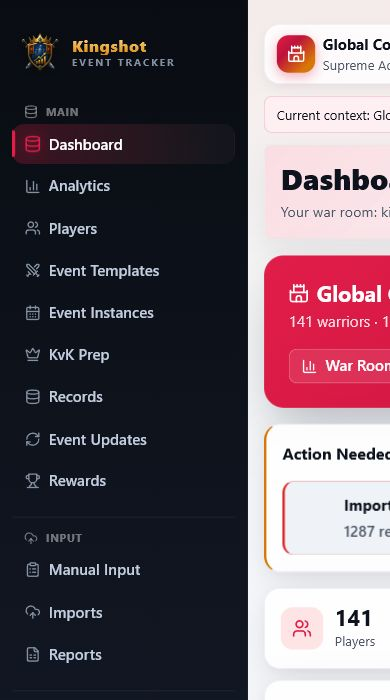

### Mobile navigation

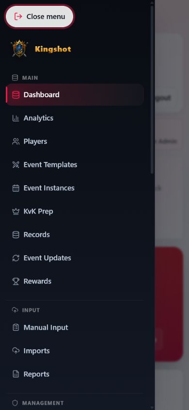

### Tablet users

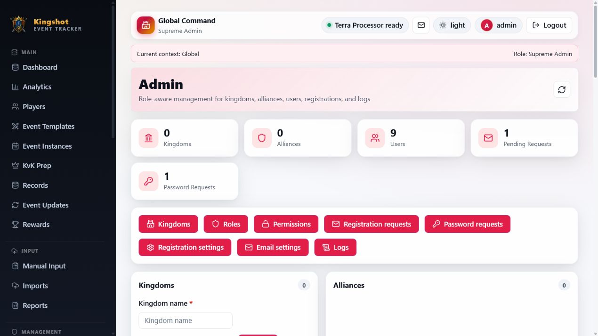

## Image processing

### Processor selection

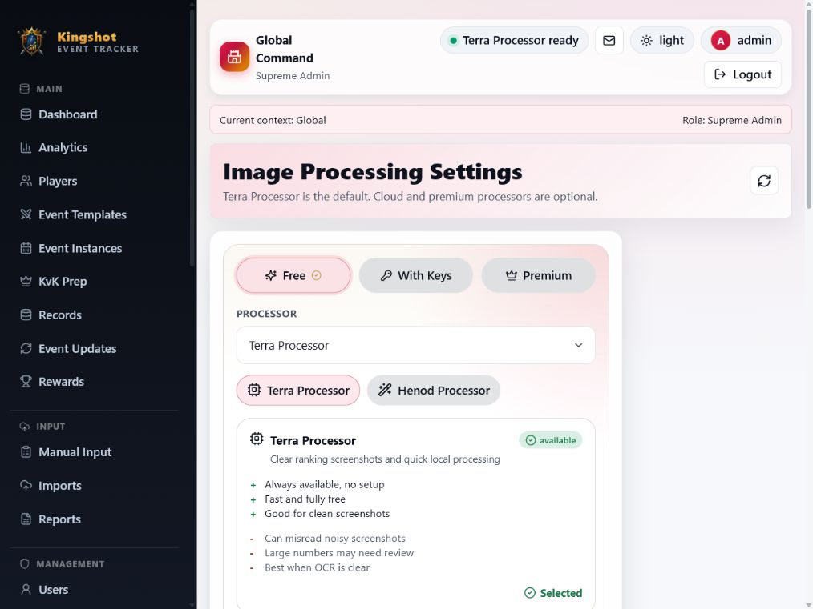

## Operations console

### Platform Console

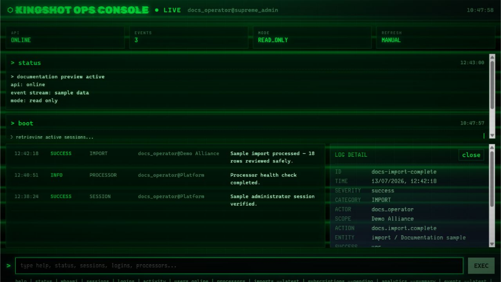

The console image uses its dedicated documentation-preview mode. It shows the settled live layout, command output, selected-event detail, and event stream using fixed sample activity only.

## Analytics

### Analytics overview

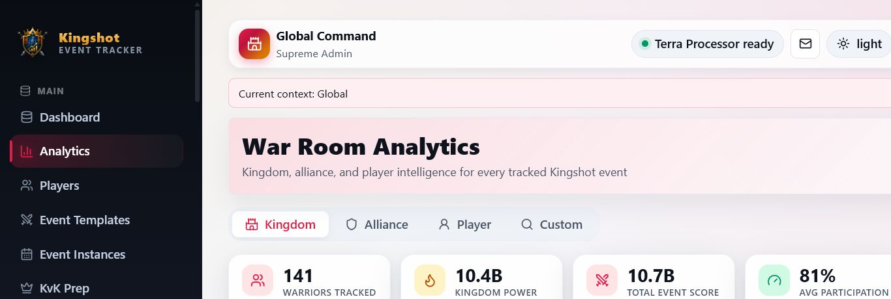

### Custom analytics

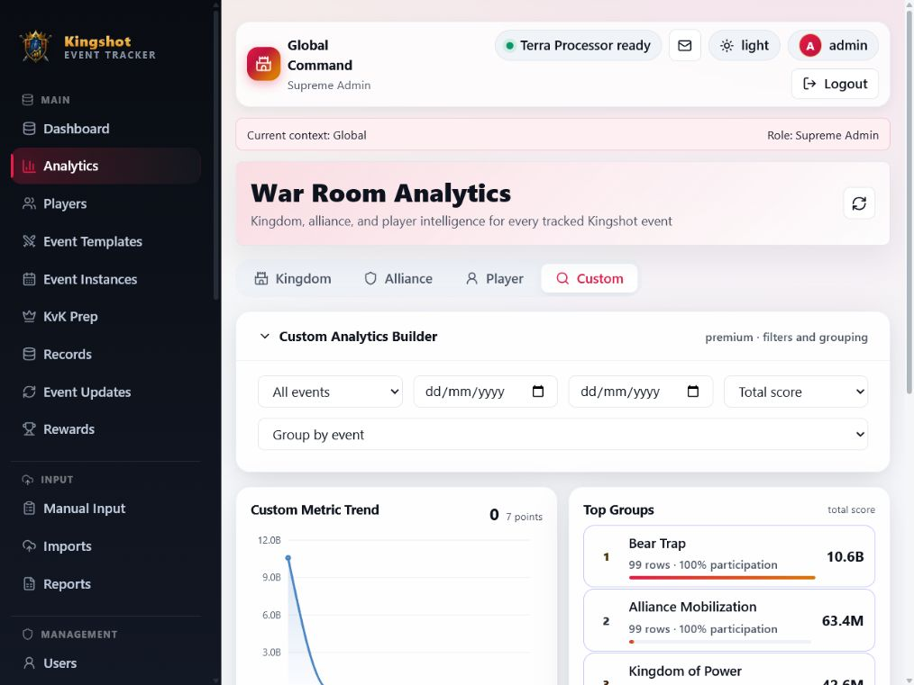

### Alliance analytics

### Cross-alliance analytics setting

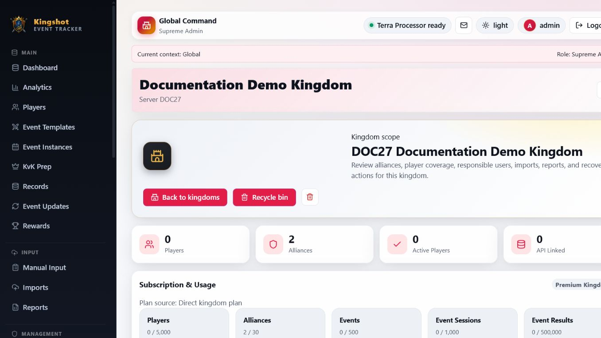

## Administration

### Users

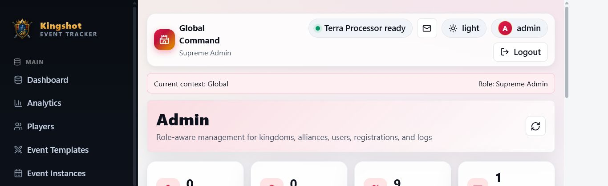

### Permissions

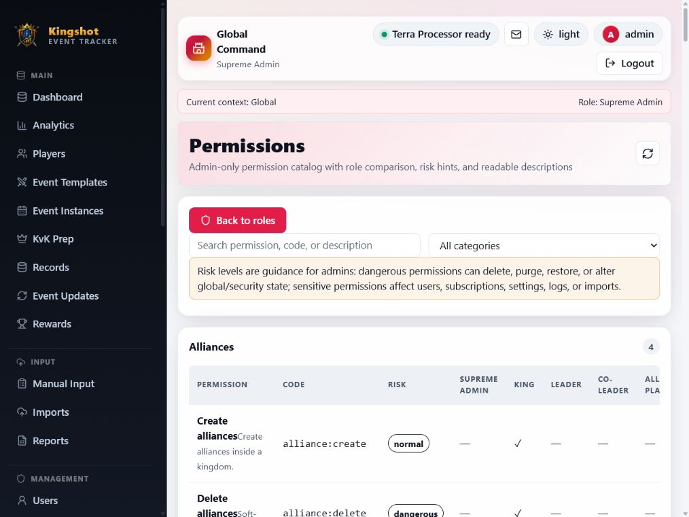

### Restore requests

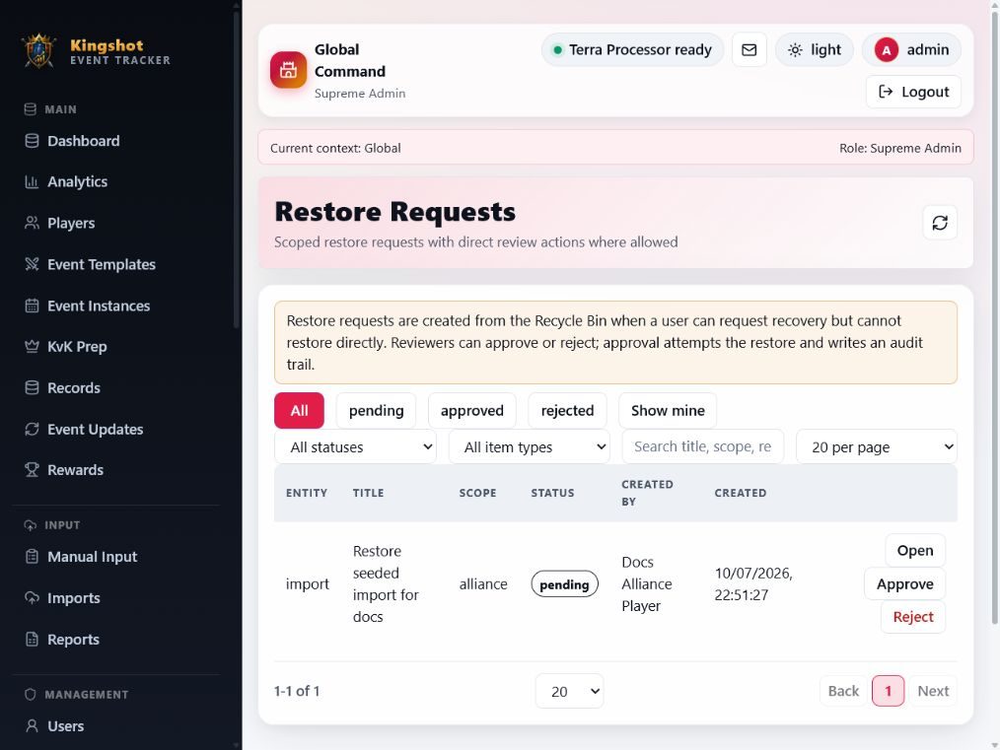

### Terms and privacy

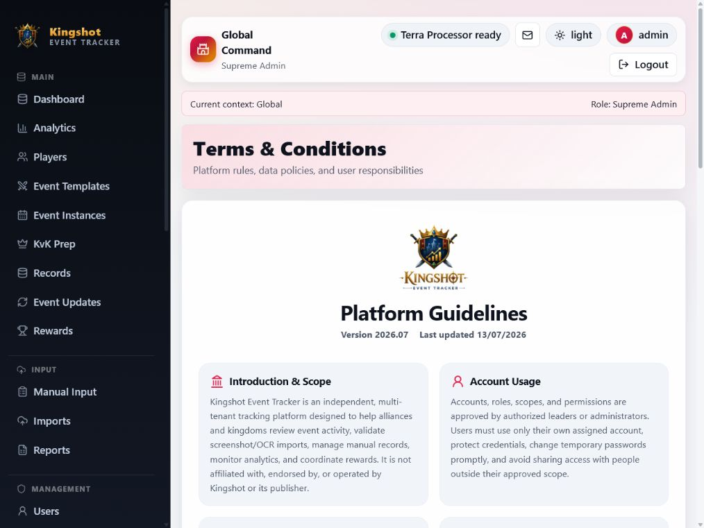
